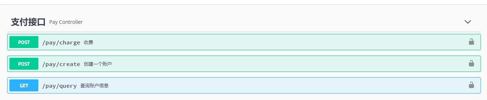
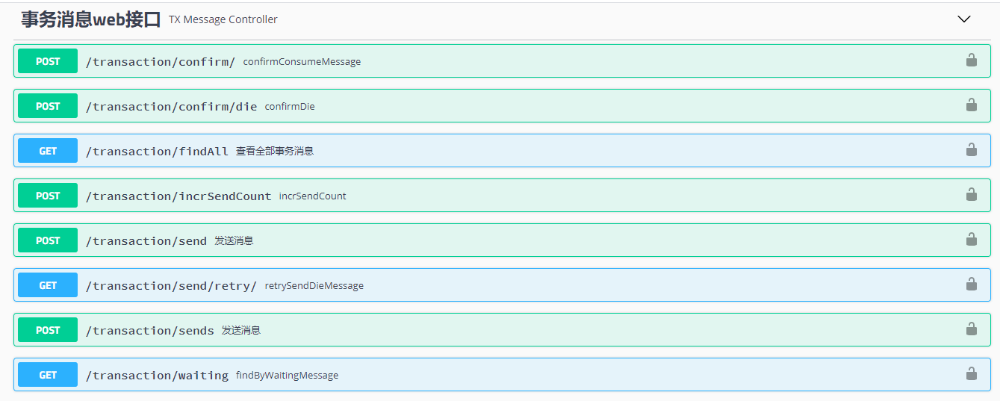
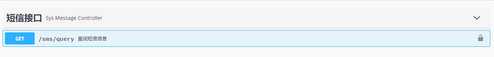

## 1、分布式下事务解决方案

### 1.1、分布式事务存在问题

​		事务是一组单元化的操作，这组操作可以保证要么全部成功，否则全部失败或者只要有一个失败的操作，就会把其他已经成功的操作回滚，来保证数据的完整性。

​		分布式事务的产生就是为了能够解决分布式环境下数据的一致性问题，单一数据库可以通过ACID来保证自身的事务处理，在分布式环境下，涉及的就是不同的服务不同数据库，单一的事务处理已经满足不了需求。

​		随着业务的发展，数据量的增加，数据库往往会做分库分表，那就会存在同时操作两个不同库中表的情况。在这种情况下想要保证数据的一致性那就必须用到分布式事务，不然A库操作成功，B库操作失败，数据就会不一致。

​		除了数据库本身的拆分会需要分布式事务来解决数据的一致性，还有就是微服务架构下，系统被拆分成n个服务，每个服务都有自己独立的数据库，也会存在同时操作不同服务的数据的情况，因此也需要一套机制来保证数据的一致性。

### 1.2、分布式事务常见的解决方案

#### 1.2.1、两阶段提交

​		二阶段提交（`Two-phase Commit`）是指在计算机网络以及数据库领域内，为了使基于分布式系统架构下的所有节点在进行事务提交时保持一致性而设计的一种算法(`Algoruthm`)。

​		通常，二阶段提交也被称为是一种协议，在分布式系统中，每个阶段虽然可以知晓自己的操作是成功还是失败，却无法知道其他节点操作的成功或失败。当一个事务跨越多个节点时，为了保持事务的ACID特性，需要引入一个作位协调者的组件来统一掌控所有节点（称作参与者）的操作结果并最终提示这些节点是否要把操作结果进行真正的提交（比如将更新后的数据写入磁盘等）。因此，二阶段提交的算法思路可以概括为：参与者将操作成败通知协调者，再由协调者根据所有参与者的反馈情况决定各参与者是要提交操作还是中止操作。

#### 1.2.2、TCC补偿机制

​		TCC（`Try-Confirm-Cancel`）是分布式事务中比较常用的解决方案之一，通过TCC的名称可以知道分别对应`Try`、`Confirm`和`Cancel`三种操作，这三种操作的业务含义如下：

- Try：预留业务资源
- Confirm：确认执行业务操作
- Cancel：取消执行业务操作

​		在一个跨服务的业务操作中，首先通过Try锁定服务中的业务资源进行资源预留，只有资源预留成功了，后续的操作常年正常进行。Confirm操作是在Try之后进行的操作，对Try阶段锁定的资源进行业务操作。Cancel则是在所有操作失败时用于回滚，TCC的操作都需要业务方提供对应的功能，在开发成本上比较高。

​		常用的TCC框架：

- [spring-cloud-rest-tcc](https://github.com/prontera/spring-cloud-rest-tcc)
- [tcc-transaction](https://github.com/changmingxie/tcc-transaction	)
- [EasyTransaction](https://github.com/QNJR-GROUP/EasyTransaction)
- [ByteTCC](https://github.com/liuyangming/ByteTCC	)

#### 1.2.3、最大努力通知型事务

​		最大努力通知型事务即尽最大努力通知到对方，但是不保证一定能通知到，可以提供查询接口给对方查询。最大努力通知型事务适合用于跟外部系统之间的通讯，通过定期通知的方式来达到数据的一致性。

​	   例如有一个系统，提供Sass服务给客户方调用，但是客户要求服务方的某一个功能的操作数据必须推送给他们，推送可能是有的，但是不一定能收到，所以有一个最大的通知次数。第一次通知，没有收到确认消息，那么过一段时间继续通知，直到达到最大的通知次数。

​		所有的次数都达到之后，对方如果还是没有收到，作为服务方应该提供接口，对方可以查询接口获取数据。

​		支付回调也是类似的原理，支付接口都需要一个回调地址，在支付成功后，支付公司会将支付结果通过调用回调地址返回。如果没有收到支付成功的通知，支付公司会重复回调你接口，知道通知N次后不再通知。

#### 1.2.4、最终一致性

​		最终一致性是比较常用的一种方式，跟TCC方式比起来成本也较低，通过结合消息队列来实现异步处理，由于消息队列不支持事务，所以需要我们自己编写一些代码结合消息队列来实现。

​		基于消息实现的最终一致性，其中消息分为普通消息、事务消息、本地消息以及独立消息。其中基于本地消息是无法保证最终一致性的。事务消息需要消息队列支持事务，常用的消息队列有`ActiveMQ`、`RabbitMQ`、`Kafka`、`RocketMQ`等，只有`RocketMQ`支持事务消息。当系统没有选择`RocketMQ`时，我们需要使用本地消息来实现。但是它有一个比较严重的弊端，每个业务系统在使用该方案时，都需要在对应的业务库创建一张消息表来存储消息。针对这个问题，可以将该功能单独提取出来，做成一个消息服务来统一处理也就是独立消息，将消息做成一个独立的服务。

### 1.3、最终一致性案例

#### 1.3.1、选型技术

> 基于Spring Cloud Finchley.SR4、Spring Boot 2.0.6.RELEASE构建分布式环境，以下组件可以使用阿里体系替换。

- 服务注册中心
  - Netflix Eureka
- 服务网关
  - Netflix Zuul
- 客服端负载均衡
  - Netflix Ribbon
- 断路器
  - Netflix Hystrix

- 配置中心
  - 携程Apollo（本次案例未使用）

#### 1.3.3、开发工具

- IDEA 2019
- REDIS
- RABBITMQ（创建example用户）
- 数据库（H2内嵌）

#### 1.3.2、接口说明

- 接口文档

  - 支付接口：http://localhost:8092/swagger-ui.html

    

  - 事务消息接口：http://localhost:8090/swagger-ui.html

    

  - 短信消息接口：http://localhost:8093/swagger-ui.html

    

#### 1.3.3、程序模块说明

- example-discovery：服务注册中心，端口8761，需要启动
- example-gateway：服务网关，端口9527，需要启动
- example-model：通用层，含实体类，工具类，统一异常处理，状态码等基本组件
- example-pay-server：支付服务，端口8092，需要启动，启动成功访问接口文档
- example-sms-server：短信服务，端口8093，需要启动，启动成功访问接口文档
- example-tx-client：提供事务远程调用接口
- example-tx-server：事务消息服务，端口8090，需要启动，启动成功访问接口文档
- example-tx-task：事务消息发送器，端口8091，需要启动，基于分布式锁实现，存在问题不支持分布式任务调度(可集成分布式调度框架解决）

#### 1.3.4、接口测试说明

> 事务消息服务可以做成一个可视化界面进行管理

- 第一步：使用创建一个账户接口创建账户，此时会写入到sys_pay表中，此时不会写事务消息表sys_transaction_message。
- 第二步：使用收费接口收取费用，此时会更新sys_pay表，同时会调用远程接口写入sys_transaction_message表
- 第三步：在没有启动example-tx-task服务时，通过事务消息服务接口文档，查看写入的事务消息
- 第四步：启动事务消息发送器，等待一会儿，消息会被消费，关闭服务（开着服务会比较卡）
- 第五步：通过短信服务接口文档查看是否被写入数据

